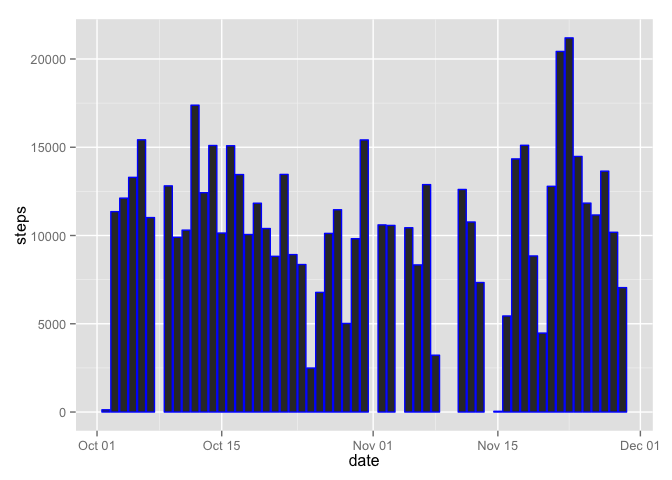
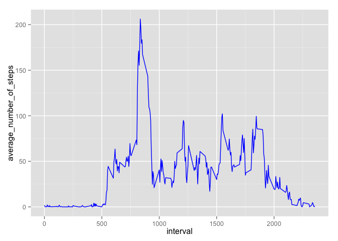
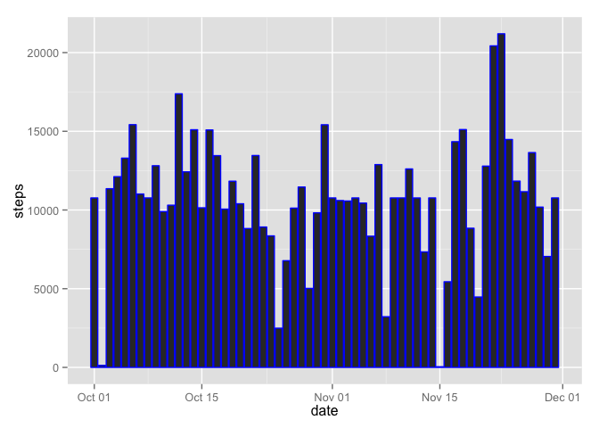
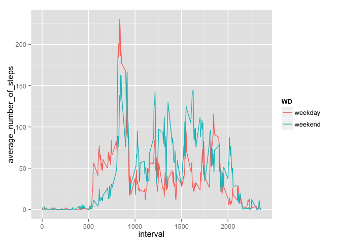

# Peer Assessment 1

This is a report for the peer assessment of the coursera's Reproducible Research course.

Information about the raw data and the questions may be found in README file.

##1. Loading and preprocessing the data

First of all, i am assuming that activity.csv file is present in your working directory.

Let's read it into "df" variable.


```r
df <- read.csv("activity.csv")
```

##2. What is mean total number of steps taken per day?

- Total number of steps taken each day:

 

- Average number of steps per day is 1.076619\times 10^{4}, median is 10765.

##3. What is the average daily activity pattern?

- This is a time series plot of the 5-minute interval (x-axis) and the average number of steps taken, averaged across all days (y-axis).

 

- 5-minute interval time interval with the maximum number of steps starts at 08:35:00.

##4. Imputing missing values


- Total number of NA's in dataset is 2304;

- Let's fill NA values with averages for each time interval:


```r
joined <- merge(df,dat2,by="interval")[c(colnames(df),"average_number_of_steps")]
for (i in 1:nrow(joined)) {
    if(is.na(joined[i,"steps"]))
    joined[i,"steps"] <- joined[i,"average_number_of_steps"]
}
joined$average_number_of_steps <- NULL
```

- With our new dataset we will again do tasks from paragraph 2. Total number of steps taken each day:

 

- Average number of steps per day is 1.076619\times 10^{4}, median is 1.0766189\times 10^{4}. Both of them are almost the same before and after filling NA's. Total number of steps per day slightly increased (which we can see from the plot above) in some cases.

##5. Are there differences in activity patterns between weekdays and weekends?

- Create a weekend/weekday factor:


```r
joined <- transform(joined, date = as.Date(date))
joined$WD <- weekdays(joined$date)
for(i in 1:nrow(joined)){
    if(joined[i,"WD"] %in% c("Saturday", "Sunday")){
        joined[i,"WD"] <- "weekend"
    }
    else{
        joined[i,"WD"] <- "weekday"
    }
}
```

- Plot containing a time series plot of the 5-minute interval (x-axis) and the average number of steps taken, averaged across all weekday days or weekend days (y-axis):

 
